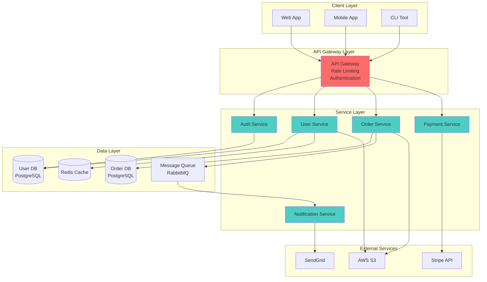
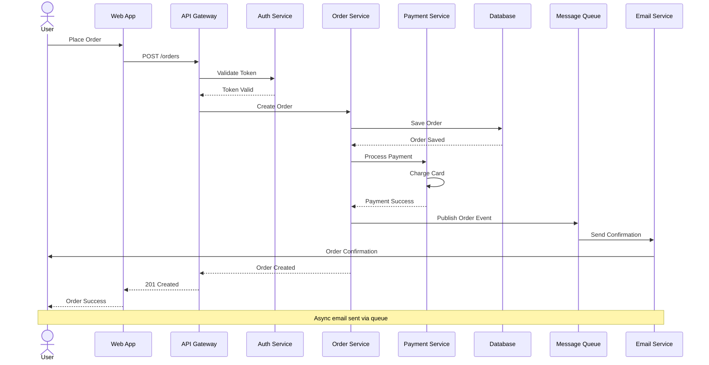
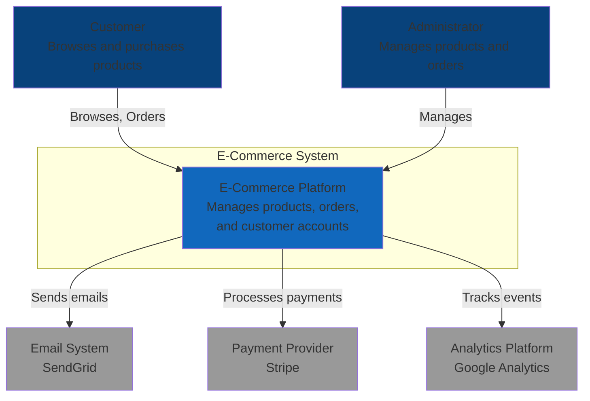
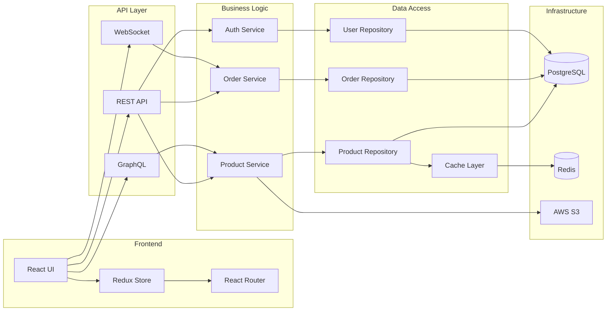
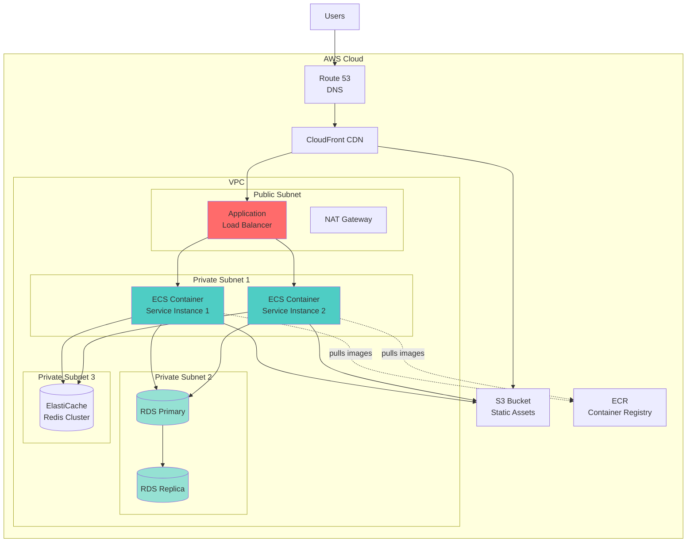
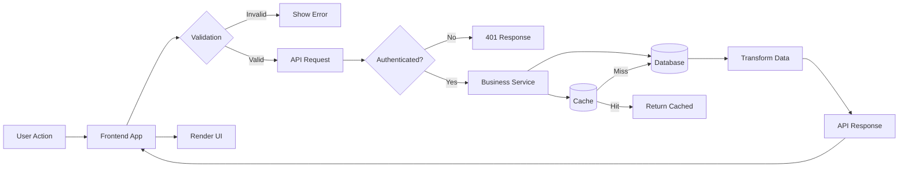
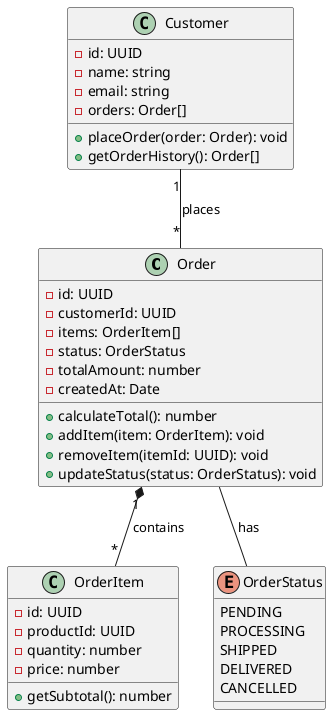
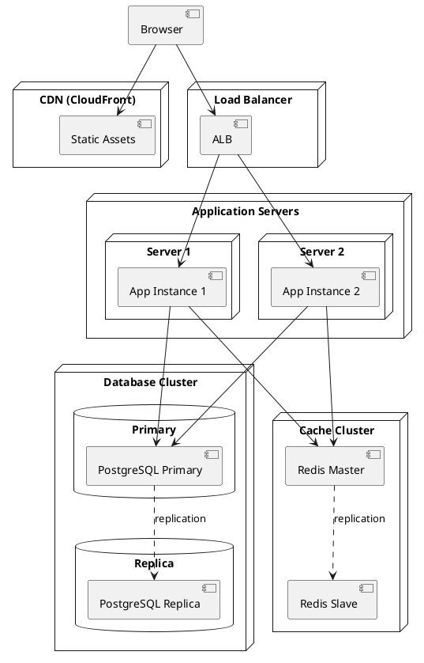

# Architecture Diagrams

## Overview

Create clear, maintainable architecture diagrams using code-based diagramming tools like Mermaid and PlantUML for system design, data flows, and technical documentation.

## When to Use

- System architecture documentation
- C4 model diagrams
- Data flow diagrams
- Sequence diagrams
- Component relationships
- Deployment diagrams
- Infrastructure architecture
- Microservices architecture
- Database schemas (visual)
- Integration patterns

## Mermaid Examples

### 1. **System Architecture Diagram**



### 2. **Sequence Diagram**



### 3. **C4 Context Diagram**



### 4. **Component Diagram**



### 5. **Deployment Diagram**



### 6. **Data Flow Diagram**



## PlantUML Examples

### 1. **Class Diagram**



### 2. **Component Diagram**

```plantuml
@startuml
package "Frontend" {
  [Web App]
  [Mobile App]
}

package "API Gateway" {
  [Load Balancer]
  [API Gateway]
}

package "Microservices" {
  [User Service]
  [Product Service]
  [Order Service]
  [Payment Service]
}

package "Data Stores" {
  database "PostgreSQL" {
    [User DB]
    [Product DB]
    [Order DB]
  }
  database "Redis" {
    [Cache]
    [Session Store]
  }
}

[Web App] --> [Load Balancer]
[Mobile App] --> [Load Balancer]
[Load Balancer] --> [API Gateway]
[API Gateway] --> [User Service]
[API Gateway] --> [Product Service]
[API Gateway] --> [Order Service]
[API Gateway] --> [Payment Service]

[User Service] --> [User DB]
[Product Service] --> [Product DB]
[Order Service] --> [Order DB]
[User Service] --> [Cache]
[Product Service] --> [Cache]
[API Gateway] --> [Session Store]
@enduml
```

### 3. **Deployment Diagram**



## Best Practices

### ✅ DO
- Use consistent notation and symbols
- Include legends for complex diagrams
- Keep diagrams focused on one aspect
- Use color coding meaningfully
- Include titles and descriptions
- Version control your diagrams
- Use text-based formats (Mermaid, PlantUML)
- Show data flow direction clearly
- Include deployment details
- Document diagram conventions
- Keep diagrams up-to-date with code
- Use subgraphs for logical grouping

### ❌ DON'T
- Overcrowd diagrams with details
- Use inconsistent styling
- Skip diagram legends
- Create binary image files only
- Forget to document relationships
- Mix abstraction levels in one diagram
- Use proprietary formats

## Resources

- [Mermaid Documentation](https://mermaid.js.org/)
- [PlantUML Documentation](https://plantuml.com/)
- [C4 Model](https://c4model.com/)
- [Diagrams as Code](https://diagrams.mingrammer.com/)
- [draw.io](https://www.diagrams.net/)
